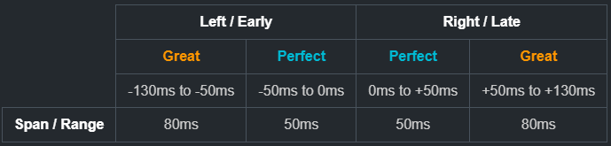
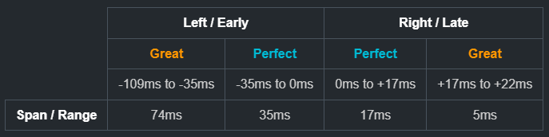

# StricterJudge

*Original mod by [**@Ixy**](https://github.com/lxymahatma)*.\
Reduces the judgement timing windows to increase difficulty.

## Features

* Allows changing default judge ranges.
* Allows asymmetric judge ranges.
* In-game [toggle](#toggle) to enable/disable the mod.
* Displays your current ranges on the [victory screen](#victory-screen-custom-ranges-visualizer).

## Settings

The config file can be found at `${Your muse dash folder}/UserData/StricterJudge.cfg`.

**See [range explanation](#range-explanation) for a more detailed explanation and examples.*

* `IsEnabled` stores the toggle state.
* `GreatLeftRange` has to be between 0ms - 80ms.
* `PerfectLeftRange` has to be between 1ms - 50ms.
* `PerfectRightRange` has to be between 1ms - 50ms.
* `GreatRightRange` has to be between 0ms - 80ms.

Decimals
: Decimals get truncated (ej. `37.7` &rarr; `37`).

## Range Explanation

Muse Dash's default timing window looks something like this:

<!--

<table class="tb">
    <tr>
        <th class="em"></th>
        <th colspan=2>Left / Early</th>
        <th colspan=2>Right / Late</th>
    </tr>
    <tr>
        <th class="em"></th>
        <th class="gr">Great</th>
        <th class="pr">Perfect</th>
        <th class="pr">Perfect</th>
        <th class="gr">Great</th>
    </tr>
    <tr>
        <td class="em"></td>
        <td>-130ms to -50ms</td>
        <td>-50ms to 0ms</td>
        <td>0ms to +50ms</td>
        <td>+50ms to +130ms</td>
    </tr>
    <tr>
        <th>Span / Range</th>
        <td>80ms</td>
        <td>50ms</td>
        <td>50ms</td>
        <td>80ms</td>
    </tr>
</table>
-->

* **Left** means an **early** hit.
* **Right** means a **late** hit.

Which means the default values are:

* `GreatLeftRange = 80`
* `PerfectLeftRange = 50`
* `PerfectRightRange = 50`
* `GreatRightRange = 80`

You can change this values to customize the timing window.

### Example

If you have the following settings:

* `GreatLeftRange = 74.0`
* `PerfectLeftRange = 35.0`
* `PerfectRightRange = 17.0`
* `GreatRightRange = 5.0`

Your timing window will look like this:

<!--
<table class="tb">
    <tr>
        <th class="em"></th>
        <th colspan=2>Left / Early</th>
        <th colspan=2>Right / Late</th>
    </tr>
    <tr>
        <th class="em"></th>
        <th class="gr">Great</th>
        <th class="pr">Perfect</th>
        <th class="pr">Perfect</th>
        <th class="gr">Great</th>
    </tr>
    <tr>
        <td class="em"></td>
        <td>-109ms to -35ms</td>
        <td>-35ms to 0ms</td>
        <td>0ms to +17ms</td>
        <td>+17ms to +22ms</td>
    </tr>
    <tr>
        <th>Span / Range</th>
        <td>74ms</td>
        <td>35ms</td>
        <td>17ms</td>
        <td>5ms</td>
    </tr>
</table>
-->

## In-game screenshots

### Toggle

### Victory screen custom ranges visualizer

* `LPerf` = `PerfectLeftRange`
* `LGreat` = `GreatLeftRange`
* `RPerf` = `PerfectRightRange`
* `RGreat` = `GreatRightRange`

## Installation

### Prerequisites

* Make sure you have `MelonLoader 0.6.1` or higher installed and working on your Muse Dash.
* [MuseDashMirror 3.1.3](https://github.com/MDMods/MuseDashMirror/releases/latest) or higher

### Steps

1. Download the latest release from [releases](https://github.com/Asgragrt/StricterJudge/releases/latest).
2. Download and install `MuseDashMirror 3.1.3`.
3. Move `StricterJudge.dll` to `${Your muse dash folder}/Mods`.
4. Run the game once to initialize the configuration file for the mod ~~or you can write your own configuration file~~.
5. Close the game and modify the `GreatLeftRange`, `PerfectLeftRange`, `PerfectRightRange` and `GreatRightRange` to your
   preferred range.

##  ❗Check out my other [mods](https://github.com/Asgragrt#musedash-modding)❗